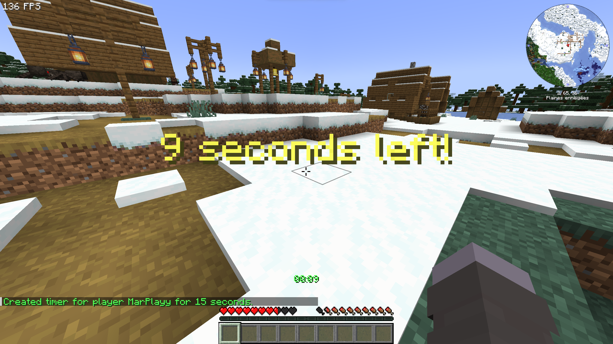

# PlaytimeLimiter

A practical, lightweight, and server-side Fabric mod designed to manage and limit daily/session playtime for players (ideal for family and parental control on private servers).

  

---

## Features

- **Server-Side Only**: Runs exclusively on the server. Players do not need to install anything on their clients.
- **Persistent Storage**: Saves player timers securely using JSON configuration (`TimerConfig`) via Gson with UUID-to-String serialization.
- **Dynamic UI & Visual Alerts**: 
  - Action Bar live timer displaying remaining time with smart percentage-based color scaling (`Green > 50%`, `Yellow > 10%`, `Red <= 10%`).
  - Center-screen milestone titles (e.g., at 1 minute, 15 seconds, and final countdown alerts).
- **Pause & Resume System**: Temporarily freeze a player's timer (e.g., during dinner) with intelligent session-time shifting to prevent sudden expiration.
- **Administrative Commands**: Full control suite for server operators to set, remove, pause, unpause, and list active timers.

---

## Commands & Permissions

All commands require operator permission level `2`.

| Command | Description |
| :--- | :--- |
| `/timer set <player> <seconds>` | Sets or updates a playtime limit for a specific player and resets their session. |
| `/timer remove <player>` | Removes the playtime limit from a player. |
| `/timer pause <player>` | Freezes the player's timer and displays a pause indicator. |
| `/timer unpause <player>` | Resumes the player's timer, automatically adjusting for the paused duration. |
| `/timer list` | Displays all active timers and their current pause status. |

---

## Configuration

Timers are automatically saved to `config/playtimelimiter/timers.json` inside your server directory. You can manage them in-game using `/timer` commands.

---

## License

This project is open-source and available under the MIT License.